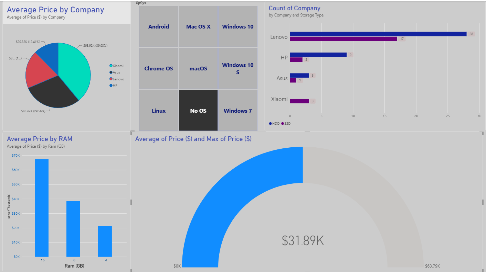

# 💻 Laptop Market Analysis Dashboard

An interactive Power BI Dashboard analyzing laptop specifications, price distributions, RAM capacity, and storage types across different technology brands.

---

## 📊 Dashboard Preview

---

## 🔑 Key Features & Insights
- **Price Analysis:** Average laptop pricing grouped by company and RAM capacities.
- **Hardware Distribution:** Analysis of storage types (SSD, HDD, Flash Storage) per brand.
- **Interactive Filtering:** Filter entire visualizations dynamically by Operating System (OpSys).
- **Gauge KPIs:** Real-time tracking of average vs max price metrics.

---

## 🛠️ Tools & Technologies
- **Power Query:** Data cleaning and transformations.
- **Power BI Desktop:** Data modeling, DAX measures, and visual design.
